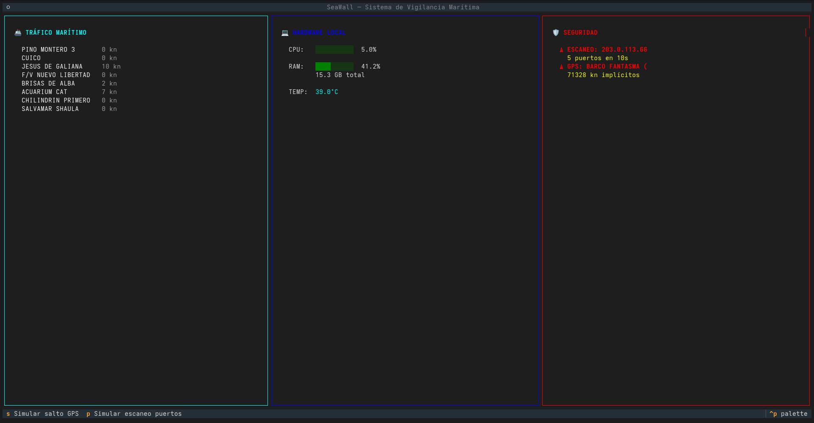

# 🛡️ SeaWall
 
**Panel interactivo de terminal (TUI) que combina monitoreo de tráfico marítimo en tiempo real, métricas de hardware local y detección de anomalías de seguridad.**
 
Construido en Python con [Textual](https://github.com/Textualize/textual), conectado a datos AIS reales vía [AISStream.io](https://aisstream.io) y con un motor propio de detección de spoofing GPS y escaneo de puertos.
 


 
---
 
### 📸 Capturas



*Panel completo con datos AIS reales de la costa gallega, monitoreo de hardware en vivo, y dos alertas de seguridad activas (escaneo de puertos simulado y salto GPS simulado).*
 
---
 
## ✨ Características
 
- **🚢 Tráfico marítimo en tiempo real** — Conexión WebSocket a [AISStream.io](https://aisstream.io) mostrando posición y velocidad de barcos reales en la costa de Galicia (configurable a cualquier zona del mundo).
- **💻 Monitoreo de hardware** — CPU, RAM y temperatura del sistema, leídos con `psutil` y actualizados cada segundo sin bloquear el resto de la interfaz.
- **🛡️ Detección de anomalías de seguridad**:
  - **Spoofing GPS**: calcula la velocidad implícita entre posiciones consecutivas de un mismo barco usando la fórmula de Haversine; marca como sospechoso cualquier salto físicamente imposible.
  - **Escaneo de puertos**: vigila las conexiones de red activas de la máquina y detecta el patrón de "múltiples puertos distintos desde la misma IP en poco tiempo", típico de un escaneo tipo `nmap`.
- **⌨️ Modo demo** — Atajos de teclado (`s`, `p`) para disparar simulaciones controladas de ambos tipos de amenaza, útil para pruebas y presentaciones.
---
 
## 🏗️ Arquitectura
 
```
seawall/
├── src/
│   ├── app.py                  # Punto de entrada — ensambla la interfaz
│   ├── widgets/
│   │   ├── barcos.py            # Panel de tráfico marítimo (AIS + detección GPS)
│   │   ├── hardware.py          # Panel de métricas del sistema
│   │   └── seguridad.py         # Panel de alertas de seguridad
│   └── modules/
│       └── seguridad.py         # Lógica pura: Haversine, detector de escaneo
├── tests/                       # Pruebas manuales y automatizadas
├── requirements.txt
└── .env                         # API key (no versionado)
```
 
El proyecto sigue una separación clara entre **widgets** (presentación, vive en `src/widgets/`) y **módulos** (lógica de negocio sin dependencias de interfaz, vive en `src/modules/`), lo que permite testear la detección de anomalías de forma aislada sin levantar la TUI completa.
 
---
 
## 🚀 Cómo ejecutarlo
 
### Requisitos previos
 
- Python 3.10 o superior
- Una clave gratuita de [AISStream.io](https://aisstream.io) (regístrate con GitHub)
### Instalación
 
```bash
# Clona el repositorio
git clone https://github.com/TU_USUARIO/seawall.git
cd seawall
 
# Crea y activa un entorno virtual
python3 -m venv .venv
source .venv/bin/activate
 
# Instala las dependencias
pip install -r requirements.txt
 
# Configura tu clave de API
echo "AISSTREAM_API_KEY=tu_clave_aqui" > .env
```
 
### Ejecución
 
```bash
python src/app.py
```
 
### Atajos de teclado
 
| Tecla | Acción |
|-------|--------|
| `s` | Simula un salto GPS (spoofing) |
| `p` | Simula un escaneo de puertos |
| `q` | Salir |
 
---
 
## 🧠 Conceptos técnicos demostrados
 
Este proyecto fue construido como ejercicio práctico para consolidar:
 
- **Programación asíncrona en Python** (`asyncio`, `async`/`await`) para gestionar múltiples fuentes de datos en tiempo real sin bloqueo.
- **Comunicación entre componentes** mediante el sistema de mensajes (`Message`) de Textual — un patrón equivalente al de eventos en frameworks como React.
- **Programación reactiva** con variables `reactive` que disparan redibujado automático de la interfaz.
- **WebSockets** para consumir streams de datos en vivo (AIS).
- **Geometría esférica aplicada**: fórmula de Haversine para distancias GPS reales.
- **Detección de patrones de seguridad**: lógica de transición de estado para evitar alertas duplicadas en ataques continuados.
- **Arquitectura modular**: separación de responsabilidades entre presentación (widgets) y lógica de negocio (modules).
---
 
## ⚠️ Notas y limitaciones
 
- AISStream.io opera en fase beta y no garantiza cobertura completa — la disponibilidad de datos depende de receptores terrestres cercanos a la zona configurada.
- La lectura de conexiones de red (`psutil.net_connections`) puede requerir permisos elevados en algunos sistemas Linux para ver todas las conexiones activas, no solo las del proceso actual.
- Este es un proyecto educativo de portafolio — el motor de detección de anomalías usa umbrales simplificados y no sustituye herramientas de seguridad de nivel profesional como `nmap`, `Suricata` o `Snort`.
---
 
## 📄 Licencia
 
MIT — usa, modifica y comparte libremente.
 
---
 
## 🙋 Sobre este proyecto

Construido como pieza de portafolio para demostrar habilidades en Python, programación asíncrona, ciberseguridad aplicada y diseño de interfaces de terminal. Cualquier feedback o pull request es bienvenido.
